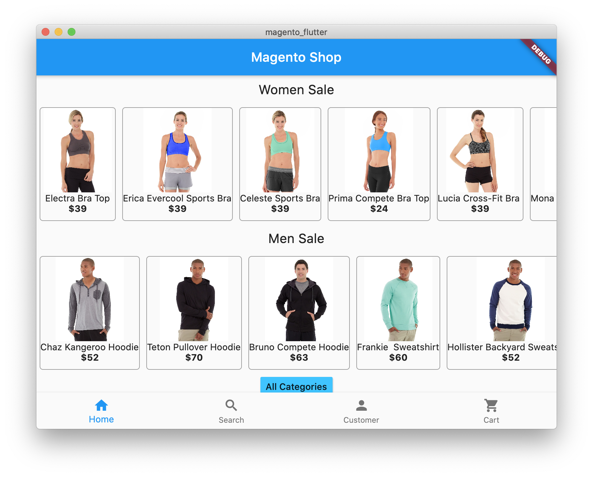
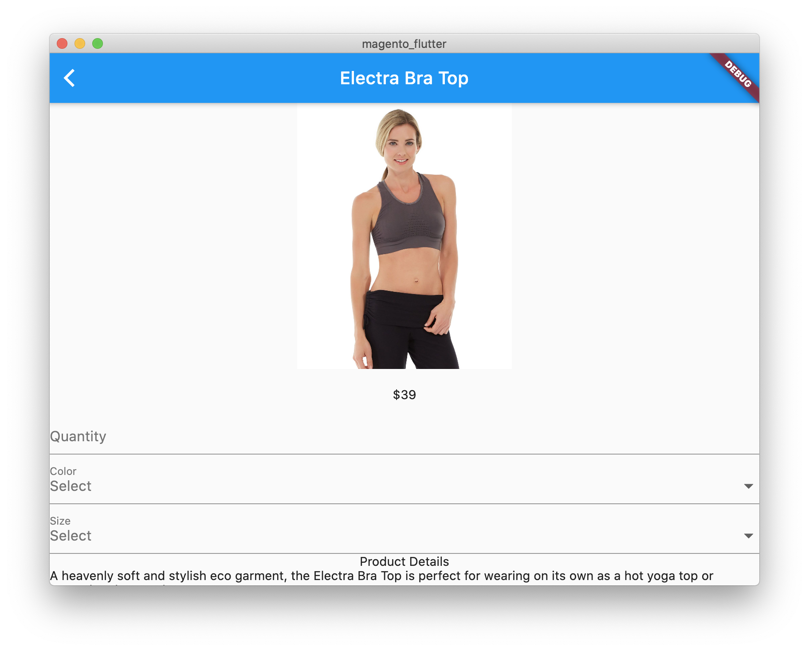
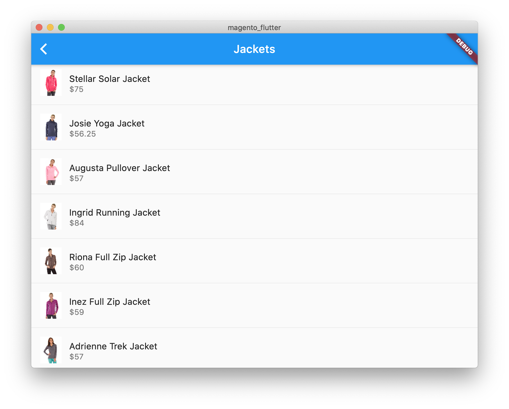

  <b>magento_flutter IS CURRENTLY IN EARLY DEVELOPMENT, NOT READY TO BE USED!</b>

# magento_flutter: Magento 2 Flutter eCommerce App

mangeto_flutter is an e-commerce app for Magento 2.3.2 onwards. it consumes [Magento 2 GraphQL API](https://devdocs.magento.com/guides/v2.3/graphql/) to display catalog, products, add products to cart and let you place order.

## :camera: Screenshots

   
   
   

## Getting Started

This project is a starting point for a Flutter application.

A few resources to get you started if this is your first Flutter project:

- [Lab: Write your first Flutter app](https://flutter.dev/docs/get-started/codelab)
- [Cookbook: Useful Flutter samples](https://flutter.dev/docs/cookbook)

For help getting started with Flutter, view our
[online documentation](https://flutter.dev/docs), which offers tutorials,
samples, guidance on mobile development, and a full API reference.
